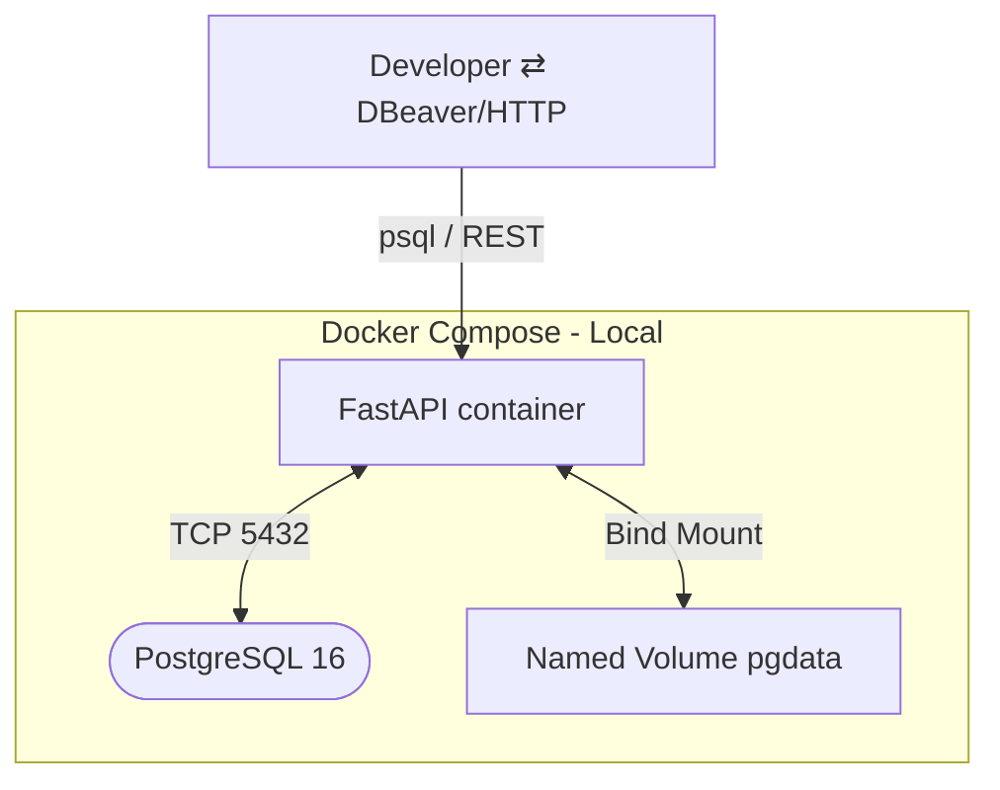

# Globant Data Engineering Challenge – Hiring Analytics API
> FastAPI · PostgreSQL · Docker · Poetry · SQLAlchemy · Pandas


## Arquitectura de referencia



*La imagen de la API se publica en el container registry para cada proveedor cloud*


## Stack tecnologico de la API

| Área | Elección | Justificación |
|------|----------|---------------|
| **Gestión dependencias** | Poetry 1.7 + `pyproject.toml` | Aisla libs, bloquea versiones y facilita reproducibilidad CI/CD. |
| **ORM** | SQLAlchemy 2 (Declarative) | Compatibilidad con `pandas.to_sql`. |
| **Carga masiva** | `/upload_csv` (`pandas.read_csv` → `to_sql`) | Simple e idempotente; casting explícito de `datetime`. |
| **Queries analíticas** | SQL en `app/queries/metrics.sql` | Separación CQRS; tuning y revisión independiente del código Python. |
| **Tests** | `pytest` + `httpx.AsyncClient` | Ejecuta contra la API real y BD efímera usando el mismo compose. |
| **CI** | GitHub Actions → `docker buildx` | No se realizó: Pipeline único que lint-test-build-push. |
| **Cloud** | Azure Container Apps / AWS ECS Fargate | Propuesta de arquitectura: Serverless containers; escala a 0; SSL/GW gestionado. |

## Ejecución local

```bash
cp .env.example .env       # configura credenciales
docker compose up --build  # API → http://localhost:8000/docs
```

## Pruebas

```bash
docker compose -f docker-compose.yml -f docker-compose.test.yml   up --build --abort-on-container-exit
```

- **Carga CSV válida:** 200 + `rows_inserted`
- **Carga inválida** (target desconocido) 400
- **Métricas 2021:** 200 + JSON no vacío
- **Path feliz:** subir CSV , para consultar `/metrics/*` sin error 500

## Despliegue cloud

### Azure Container Apps (propuesta en resumen)

```bash
az login
az group create -n rg-hiring -l eastus
az acr create -n hrdemoacr -g rg-hiring --sku Basic
az acr build -t hrdemoacr.azurecr.io/hiring-api:latest -r hrdemoacr .

az postgres flexible-server create -n hrdb -g rg-hiring -l eastus    --admin-user globant_app --admin-password 'P@55w0rd!' --sku-name Standard_B1ms

az containerapp env create -n hr-env -g rg-hiring -l eastus
az containerapp create -n hiring-api -g rg-hiring    --image hrdemoacr.azurecr.io/hiring-api:latest    --environment hr-env --target-port 8000 --ingress external    --registry-server hrdemoacr.azurecr.io    --registry-username $(az acr credential show -n hrdemoacr --query username -o tsv)    --registry-password $(az acr credential show -n hrdemoacr --query passwords[0].value -o tsv)    --env-vars DATABASE_URI="postgresql+psycopg2://globant_app:P@55w0rd!@hrdb.postgres.database.azure.com:5432/globant_challenge"
```

### AWS ECS Fargate (propuesta en resumen)

1. **ECR**: `docker push <acct>.dkr.ecr.<region>.amazonaws.com/hiring-api:latest`
2. **RDS** PostgreSQL → guardar URI en Secrets Manager  
3. **Task Def** Fargate → container `hiring-api`, puerto 8000  
4. **ALB** + ACM cert → ECS service  
5. **Auto-scaling** basado en CPU o RPS

## Cosas que me hubiese gustado incluir

- Alembic migrations + semilla inicial  
- Auth JWT para asegurar `/upload_csv`  
- Observabilidad con Azure Monitor / CloudWatch  

